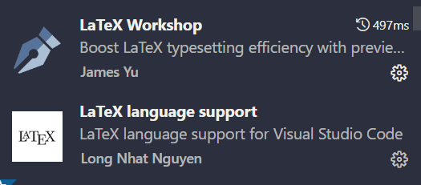
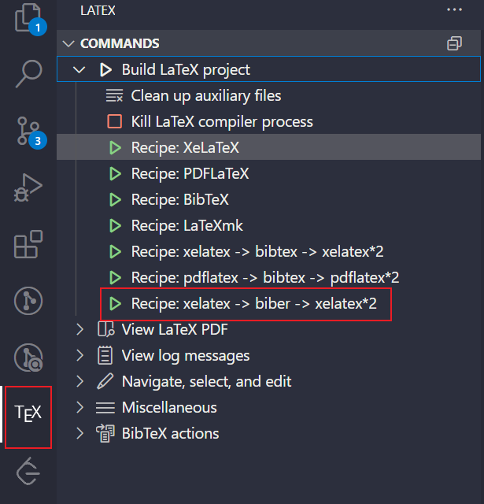

# 食用方式

## 快速食用
1. 下载整个工程目录

2. 将工程目录导入到Overleaf在线工程，配置参考根目录下的settings.png

3. tex文件内容进行自定义替换

4. 编译论文前，到源模板库中获取最新的xdupgthesis.cls然后覆盖本库的同名文件

## 参考链接
+ 源模板库，出现bug可参考：https://github.com/note286/xduts
+ 常用实例排版：https://github.com/note286/xduts/discussions/40

## 本地编译（使用Visual Studio Code）
1. 下载安装texlive: https://mirrors.tuna.tsinghua.edu.cn/CTAN/systems/texlive/Images/

2. 运行如下命令更新包
```sh
  tlmgr update --all --self
```

3. VS Code中安装LaTeX WorkShop和LaTeX language support插件



4. `ctrl+shift+p`打开用户设置（json），添加根目录下的settings.json中的配置内容

5. 运行编译链


